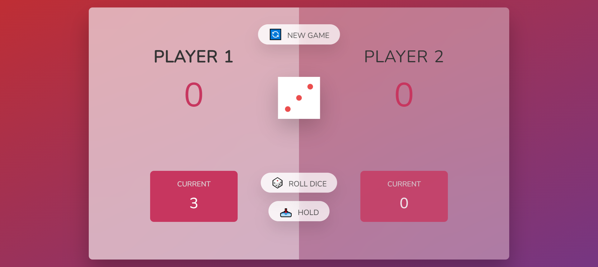
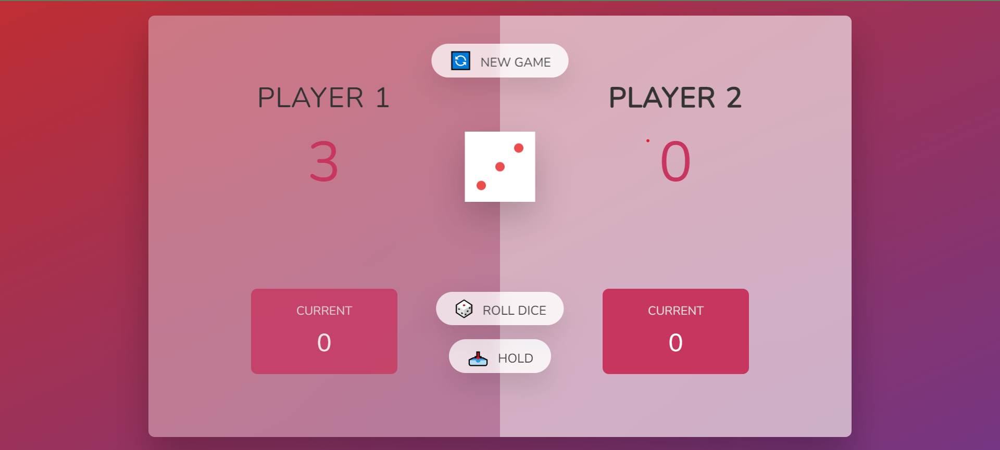
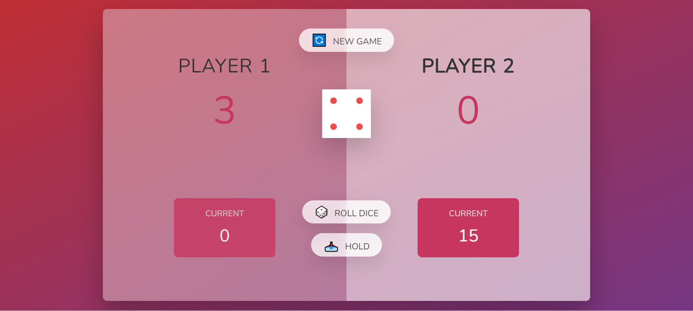
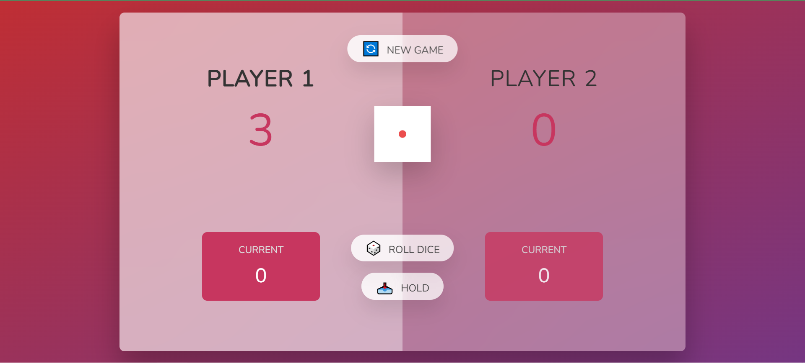

    <h1>Dice rolling game</h1>

## Yêu cầu

- Nodejs 8.10.x
- Thu phóng màn hình 90%

## Cách chơi

- Player 1 chơi trước, click ROLL DICE để tung xúc xắc, số điểm nhận được sẽ cộng vào CURRENT.
  
- Người chơi có thể click HOLD để giữ số điểm của mình và lượt chơi sẽ chuyển qua cho người đối diện.
  
- Trường hợp tung xúc xắc vào ô 1 điểm, người chơi sẽ mất số điểm đã tích lũy ở CURRENT và lượt chơi sẽ chuyển qua cho người kia.
  
  

### Link game

[Roll-Dice](https://tranhuy510.github.io/Roll-dice-game/)

Thanks for watching!
